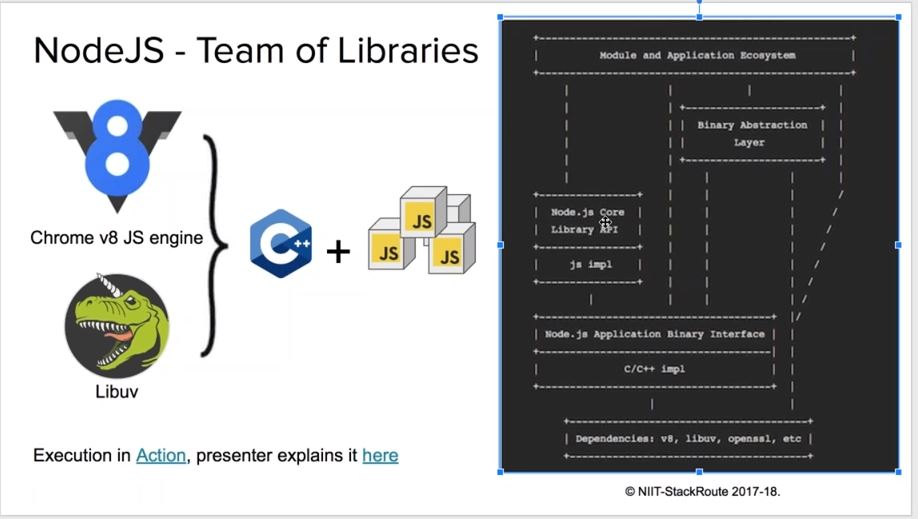
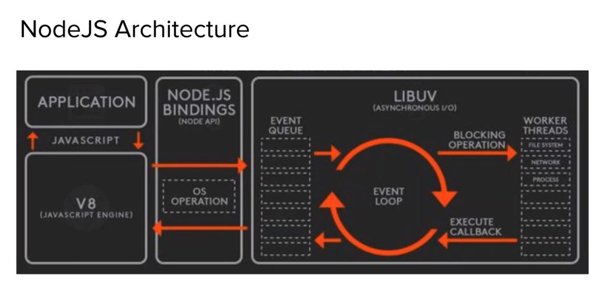

# NodeJS-sessions
## Node JS 
NodeJS gives all the ability of Javascript programing language + Some more to perform server side type of operations. 
What type of operations we usually perform on Server Side ? 
- Reading data from Database or from network.
- Listening for data or requests on a Socket or port
- Reading from File, Writing to a file
- Accessing Message Queues
- Making API requests to other server

## Basics
- parent object:
in browser DOM - we have window object which is parent.
In node environment - process is the root object
- Node never sleeps:
Node never sleep or idle - event loop executes and assigns to c++ job threads
compare to java middle ware - 30% less code lines,20% improved performance in IO operations, optimized cpu resource. 
### ryan dhal creater of node session - must see 
https://www.youtube.com/watch?v=jo_B4LTHi3I
must read - https://medium.com/@LindaVivah/the-beginners-guide-understanding-node-js-express-js-fundamentals-e15493462be1 
functional programming, async programing by event loops/ callback fns, for IO extensive applications.
express js framework for web ie routing resources.
he explains core module http createserver, raw create tcpsockets, then sockets event listener on , sockets emitters, debugger, npm package manager, call backs always to avoid blocking since single threaded - it is actually optimized the resources.  

### week1:
modules  - like packages in java. there are different modularity in js community like amd, commonjs ecma6 modules,etc. node js uses commonjs modules(require)
types - core, third party
module node docs - https://nodejs.org/api/modules.html
lodash - famous lib for collection handling.
we can use yarn also instead of npm install
```
> npm install yarn -g
> yarn
> npm install // we can use any yarn or npm for package json dependencies 
```
mocha - testing framework/ chai- assertion frame
>node_modules/mocha/bin/mocha add.spec.js // to run test

### week 2 Architecture of NodeJS


C10M Problem - server to handle concurrent 10 million requests in reasonable time (in milliseconds)

How Node JS achieved the high performance eventhough it is single threaded?
actually, js is basically interpreter line by line. But, now it is no longer merely interpreter. Now v8 engine compiles in 2 phases - 1. compiles fast to machine code but may not optimal but start executing- named as ignition compiler  2. same time another thread starts and converts optimized code which is later used by v8 engine- named as turbo-fan compiler in v8.
event loops - single threaded. it simply gets the request and send to worker threads(inside libuv c++ library).
once tasks completed, it is returned back to the front end. This makes NODE well suited for IO intensive operations.

libraries inside node js - libuv (c++ library) used for running concurrent worker threads.

I/O expressoins operations:
-filessystem (R/W/Delete/ move etc)
-networking / sockets(http,tcp, websockets, udp,ftp, )
-databases
-keyboard or devices
computation operations: high cpu needed
- algorithmns
- if loop, for loop 
- formula

Any drawbacks in node js?
yes. node is single process. so if computer is multi core, it is not using full capacity of computer core.

how code executed in processor?
usually loader(looks the instruction) -> execution stack or registry() ->cpu(executest the executed) 
check the node js - call execution view. to understand this flow , can go to the below site.
http://latentflip.com/loupe/

*** Node executes in callback style - when a tasks completes particular callback fns are running. 
this helps to achieve async style of programming.
This is widely used in js style of writing. we can pass functions as a arguments variable. 
recently even java supports functions as a variable.
callbacks to be used in async mode.
very important -----
** try catch wont work in async style. catch wont work since control long gone. it works only in sunc style of writing.
** for that in async, it is convention to write (err,arg1,..) and check the error inside.

```
Error first callbacks---
eg1:
let data = fs.readFile('abc.txt','utf8',(err,data)=>{// error 1st and args next
    if(err){// catch here
    
    return;
    }
})
eg2:
db.execute(query,function(err,result){//call back function with err param 1st

})
```
Test your async codes-- because it wont return result immediately
```
Test driven code sample
describe('test1',fucntion(){ // this line same as sync code 
    it('q for top score',fucntion(done){ // for async we send done as param 
        db.execute(query,function done(err,result){
            if(err){
                return done(err); // return error 
            }
            expect(result.to.be.an('object'));
            done(null);// null or no error 
        })
    })
})
```

